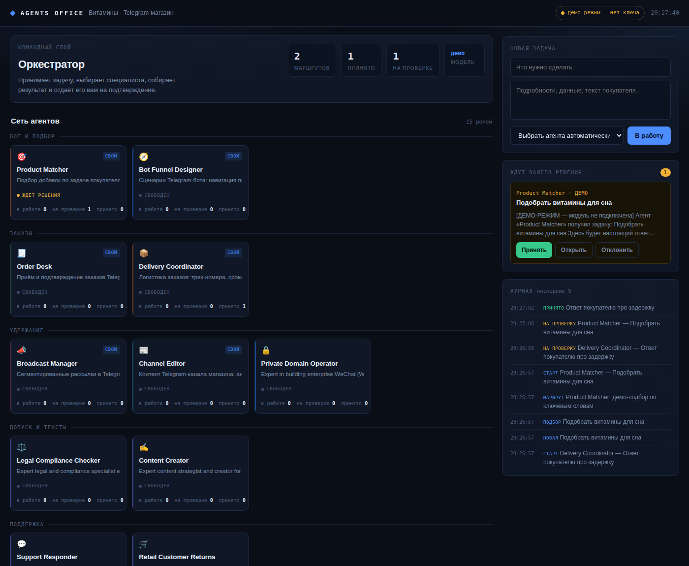

# Agents Office

Диспетчерская для агентов Vitaflow — розницы американских витаминов в Ташкенте.
Это работающая программа, а не макет: оркестратор принимает задачу, выбирает
сотрудника, запускает его на модели, показывает на его экране текст по мере
написания и кладёт результат вам на подтверждение.



Продолжаете работу в новом чате? Начните с
[`HANDOFF.md`](HANDOFF.md) — там принятые решения, состояние и границы,
которых в коде не видно.

## Что внутри

| Часть | Файл | Что делает |
|---|---|---|
| Реестр | `src/registry.js` | 27 агентов: 15 своих из `agents/` и 12 из каталога репозитория |
| Каталог | `src/catalog.js` | 203 позиции с готовыми карточками на двух языках, поиск и индекс |
| Модель | `src/llm.js` | Вызов Claude, инструменты каталога, кэш промпта, учёт стоимости |
| Управляющий | `src/review.js` | Принимает работу или возвращает на доработку |
| Оркестратор | `src/orchestrator.js` | Очередь, выбор агента, статусы, подтверждение |
| Хранилище | `src/store.js` | Журнал событий и задачи на диске, без native-зависимостей |
| Сервер | `src/server.js` | REST, поток событий SSE, отдача панели |
| Сцена офиса | `public/scene.js` | Изометрические этажи-отделы, рабочие места, камера |
| Панель | `public/` | Экран сотрудника, очередь, быстрая задача по ⌘K |

Зависимость ровно одна — `@anthropic-ai/sdk`. Остальное на стандартной библиотеке Node.

## Как это выглядит и работает

Офис нарисован изометрией: каждый отдел — свой этаж со столами, мониторами,
перегородками и сотрудниками. Клик по этажу подводит камеру к отделу, клик по
сотруднику — вплотную к его рабочему месту, и слева открывается его экран.

Текст от модели идёт потоком: `llm.js` подписывается на `stream.on('text')`,
оркестратор отдаёт накопленное не чаще четырёх раз в секунду, панель показывает
его на мониторе. Видно, что агент пишет **прямо сейчас**, а не только результат.

Сотрудники нарисованы людьми: кресло, плечи, наушники, руки на клавиатуре.
Пока агент пишет ответ, по клавишам стучат пальцы, монитор подсвечивается, а
строки на экране бегут. Время от времени сотрудник отрывается на глоток кофе —
рука с кружкой поднимается к голове.

Горячие клавиши: `⌘K` / `Ctrl+K` — быстрая задача, `←` `→` — следующий сотрудник,
`Esc` — вернуться ко всему офису.

## Командный центр

В середине офиса стоит отдельная площадка — там сидят двое, и они не из реестра
агентов, а часть самой системы:

- **Оркестратор** (`src/orchestrator.js`) — принимает задачу, выбирает
  исполнителя, ведёт очередь и статусы.
- **Управляющий** (`src/review.js`) — смотрит готовую работу и решает,
  выпускать её или вернуть.

Над ними висит общая память — пакет знаний. Кликните по любому из них, чтобы
увидеть, чем он занят: подбирает исполнителя, проверяет работу или свободен.

Оба сидят на золотых подиумах с ограждением: высокое кресло, два монитора,
лампа и табличка с должностью на торце стола. Над столами висят табло — у
оркестратора очередь задач, у управляющего счётчики принятых и возвращённых
работ. Табло живут по тем же данным, что и панель справа.

## Бар, кухня и дроны-курьеры

Перед кольцом отделов стоит отдельный островок: барная стойка с полкой бутылок,
кофемашина, витрина со сладостями, холодильник с энергетиками, столики и
док-станция курьеров. Кликните по островку (или по оранжевой точке на
мини-карте), чтобы подлететь к нему.

Пока агенты работают, с дока взлетают роботы-курьеры и развозят по столам кофе,
энергетики, пончики, воду и перекус. Заказ остаётся на столе, а сотрудник
следом делает глоток. Логика простая и дешёвая — это чистая анимация в браузере,
токены на неё не тратятся:

- курьеры вылетают не чаще раза в 2,6 секунды и не больше трёх одновременно;
- к одному столу — не чаще раза в 22 секунды;
- вкладка свёрнута или в системе включено «уменьшить движение» — полётов нет.

## Управляющий между агентом и вами

Работа специалиста не попадает к вам напрямую. Сначала её смотрит **управляющий**
(`src/review.js`) — он не пишет тексты, а проверяет по чек-листу:

- обещание лечения, диагноз, гарантия результата;
- обращение к здоровью читателя на «вы»;
- отсутствие оговорки «Не является лекарственным средством» / «Dori vositasi emas»;
- нет честного ограничения — не сказано, чего добавка не делает;
- текст только на одном языке, хотя нужны оба;
- выдуманные условия возврата (правил у магазина нет);
- обещано выключенное: оплата картой в боте, самовывоз, доставка за город;
- наружу вынесены себестоимость или наценка.

Вердикт один из двух: **принято** или **на доработку** со списком замечаний.
Во втором случае задача возвращается тому же агенту вместе с замечаниями
и предыдущей версией — и только потом попадает к вам.

Управляющий работает на дешёвой модели: это чек-лист, а не творчество.
Одна проверка стоит примерно $0.002. Выключается через `AO_REVIEW=off`.

## Сколько это стоит и на чём экономим

| Что | Цена |
|---|---|
| Задача без кэша | ≈ $0.11 |
| Она же при попадании в кэш промпта | ≈ $0.047 (**−58%**) |
| Выбор исполнителя | $0.003 вместо $0.014 на большой модели |
| Проверка управляющим | $0.002 |

Четыре рычага экономии в коде:

1. **Кэш промпта.** Системный промпт у роли не меняется от задачи к задаче,
   поэтому на нём стоит `cache_control`. Порядок префикса — `tools → system →
   messages`, поэтому набор инструментов обязан быть неизменным.
2. **Каталог не в промпте.** Вместо 136 КБ карточек — индекс на 17 КБ и
   инструменты, которые достают только нужное.
3. **Дешёвая модель на служебном.** Выбор исполнителя и проверка управляющим
   идут на `claude-haiku-4-5`.
4. **Глубина проработки по роли.** Механическим ролям стоит `medium`, пишущим
   тексты — `high`. Глубина — самый дорогой параметр после объёма контекста.

Проверить, что кэш работает: в ответе должно расти `cache_read_input_tokens`.
Если оно нулевое на повторных задачах к тому же агенту — что-то в промпте
стало меняться от вызова к вызову.

## Каталог: почему он не в промпте

203 позиции с полными карточками на русском и узбекском — это 136 КБ. Класть их
в каждый запрос бессмысленно и дорого, поэтому:

- в системный промпт идёт **компактный индекс** (17 КБ): весь ассортимент
  с ценой, остатком и дозировкой — агент видит, что есть в магазине;
- за подробностями агент вызывает инструменты `catalog_search` и `catalog_get`
  и получает готовую карточку на обоих языках.

Вызовы инструментов видны на экране сотрудника и в списке задач: «поиск
в каталоге: магний сон».

## Пакет знаний

Папка `знания/` — выгрузка из работающего магазина, собирается скриптом
`python3 знания/обновить.py`.

| файл | что внутри |
|---|---|
| `бизнес.md` | кто мы, доставка, оплата, кэшбэк, чего пока нет |
| `тон.md` | как магазин разговаривает, с примерами |
| `правила.md` | что нельзя писать про БАД |
| `доставка.md` | доставка, оплата, кэшбэк, пробел по возвратам |
| `каталог.json` · `каталог.csv` | 203 позиции с карточками на двух языках |
| `товары.md` | те же позиции по категориям, для чтения глазами |
| `вопросы.md` | 22 сценария консультанта с ответами на двух языках |
| `темы.md` | разборы тем здоровья со связкой «проблема → товары» |
| `конкуренты.md`, `база.md` | окружение и как читать базу магазина |

Каждому агенту достаётся свой срез: всем — бизнес, тон, правила, доставка
и индекс каталога; пишущим тексты добавляются темы, поддержке — сценарии,
аналитикам — описание базы. Выходит 8–21 тысяча токенов на вызов, повторные
вызовы дешевеют за счёт кэша промпта.

**Папка не коммитится.** В ней реальные цены, себестоимость, телефон и адрес,
а репозиторий публичный — поэтому `знания/` стоит в `.gitignore`. После смены
цен выполните `обновить.py` и нажмите «Перечитать знания» в окне «Мозг».

## Запуск

```bash
cd examples/agents-office
npm install
npm start
```

Без ключа панель работает в демо-режиме: агенты отвечают заглушками, но вся
механика видна. Боевой режим:

```bash
cp .env.example .env     # вписать ANTHROPIC_API_KEY
set -a && source .env && set +a
npm start
```

Ключ для этой системы стоит завести **отдельный** от того, что уже работает
в Instagram-агенте магазина: общий ключ — это общий лимит и невозможность
понять, кто сколько потратил.

## Разворачивание на сервере Vitaflow

Магазин уже живёт на `2.29.19.37` под Ubuntu: FastAPI в Docker на порту 8080,
перед ним **Caddy** (не nginx). Свободный поддомен — `agent.2-29-19-37.sslip.io`.

```bash
git clone <репозиторий> /opt/agents-office
cd /opt/agents-office/examples/agents-office
npm ci --omit=dev
```

`/etc/systemd/system/agents-office.service`:

```ini
[Unit]
Description=Agents Office
After=network.target

[Service]
Type=simple
WorkingDirectory=/opt/agents-office/examples/agents-office
EnvironmentFile=/opt/agents-office/examples/agents-office/.env
ExecStart=/usr/bin/node src/server.js
Restart=always
RestartSec=5
User=www-data

[Install]
WantedBy=multi-user.target
```

В `Caddyfile` — сертификат Caddy получит и продлит сам:

```
agent.2-29-19-37.sslip.io {
    reverse_proxy 127.0.0.1:8787 {
        flush_interval -1        # обязательно: иначе поток событий встанет
    }
}
```

```bash
sudo systemctl enable --now agents-office
sudo systemctl reload caddy
```

## Встроить в админ-панель магазина

Офис можно показать прямо внутри вашей админки отдельной вкладкой — своим
кодом её трогать не нужно, достаточно одного тега.

**1. Разрешите встраивание.** По умолчанию оно запрещено: панель показывает
данные магазина и тратит деньги, поэтому открывать её чужой странице —
осознанное решение. В `.env`:

```
AO_EMBED_ORIGIN=https://shop.2-29-19-37.sslip.io
```

Сервер отдаст заголовок `Content-Security-Policy: frame-ancestors 'self'
<ваш адрес>` — встроить панель сможет только эта страница и никакая другая.

**2. Вставьте в шаблон админки:**

```html
<iframe
  src="https://agent.2-29-19-37.sslip.io/?embed=1&token=ВАШ_ТОКЕН"
  style="width:100%;height:calc(100vh - 150px);border:0;border-radius:10px"
  title="Agents Office"></iframe>
```

`embed=1` убирает собственную шапку офиса — своя навигация у админки уже есть,
и всё место отдаётся сцене и задачам. `token` — это `AO_TOKEN` из `.env`.

**Про токен в адресе.** Он окажется в HTML вашей админки, поэтому вставляйте
его на серверной стороне шаблона и только на странице, куда попадают
администраторы. Если админка доступна кому-то ещё — лучше отдавать офис
по отдельной ссылке, а не встраивать.

**3. Проверьте, что встроилась свежая версия.** Панель отдаётся с `ETag` и
`Cache-Control: no-cache`: браузер каждый раз спрашивает сервер и получает
либо `304` без тела (дёшево), либо новый файл. После выкладки достаточно
перезагрузить страницу админки — старая панель из кэша не залипнет.

Сверить, что именно крутится на сервере:

```
curl -s https://agent.2-29-19-37.sslip.io/api/version?token=ВАШ_ТОКЕН
```

Ответ: `build` — отпечаток файлов панели, `startedAt` — когда сервер запущен,
`catalogSource` и `catalogReadAt` — откуда и когда прочитан каталог. Если
`build` в ответе меняется после выкладки, а в браузере ничего не поменялось —
дело в прокси перед сервером, а не в панели.

### Безопасность

Панель запускает платные вызовы модели и показывает данные магазина.

- Задайте `AO_TOKEN` перед тем, как открывать её наружу: вход будет по
  `https://agent.2-29-19-37.sslip.io/?token=...`
- Держите `AO_HOST=127.0.0.1` — наружу только через Caddy.
- `.env` и `знания/` не коммитятся.
- В таблице `customers` магазина лежат имена и телефоны живых людей. Выгружать
  их в эту систему и передавать третьим сервисам нельзя.

## Живой каталог: правки в админке доходят сами

По умолчанию агенты читают снимок из папки `знания`. Значит правка цены или
остатка в админке до них не доходит, пока снимок не пересобрали руками
(`python3 знания/обновить.py` + кнопка «Перечитать знания»).

Чтобы этого шага не было, укажите адрес каталога магазина в `.env`:

```
AO_CATALOG_URL=https://shop.2-29-19-37.sslip.io/api/catalog
AO_CATALOG_TOKEN=токен_только_на_чтение
AO_CATALOG_REFRESH_SEC=120
```

Дальше офис сам перечитывает каталог раз в две минуты, а также по кнопке
«Перечитать знания». В журнале задач появляется запись
«Каталог из магазина: N позиций, M в наличии».

**Что должен отдавать эндпоинт.** Массив товаров — либо голым списком, либо
в обёртке `{"товары": []}`, `{"items": []}`, `{"products": []}` или
`{"data": []}`. Имена полей можно английские, офис приводит их сам:

| нужно офису | принимаются также |
|---|---|
| `id` | `sku`, `артикул`, `code` |
| `название` | `name`, `title`, `наименование` |
| `бренд` | `brand`, `производитель` |
| `категория` | `category`, `группа` |
| `цена_сум` | `price`, `price_uzs`, `sale_price`, `цена` |
| `остаток` | `stock`, `quantity`, `qty`, `количество` |
| `штук_в_банке` | `count`, `pieces`, `per_pack` |

**Себестоимость и наценку в этот эндпоинт не кладите.** Офису они не нужны, и
чем меньше внутренних цифр ходит по сети, тем лучше. Доступ — только на
чтение: офис никогда ничего не пишет в магазин.

**Если магазин не ответил**, офис не обнуляет ассортимент: он продолжает
работать по последней удачной копии и пишет в журнал
«Каталог из магазина не прочитан: … Работаю по последней копии».

## Заказы: агенты видят, что купили на самом деле

Тот же приём, что и с каталогом — адрес в `.env`, только чтение:

```
AO_ORDERS_URL=https://shop.2-29-19-37.sslip.io/api/orders
AO_ORDERS_TOKEN=токен_только_на_чтение
AO_ORDERS_REFRESH_SEC=60
```

Массив заказов в обёртке `{"заказы": []}`, `{"orders": []}`, `{"items": []}`
или `{"data": []}`. Поля принимаются русские и английские: `order_id`/`номер`,
`status`/`статус`, `total`/`сумма`, `city`/`город`, `items`/`позиции`,
`chat_id`/`чат_id`.

После этого у агентов появляются инструменты `orders_search` и `orders_get`, и
оживают те, кому без заказов было нечего делать: приём заказов, координатор
доставки, планировщик закупок.

**Телефон покупателя агенту не отдаётся.** Поле читается, но в карточку,
которую видит модель, не попадает, и в карточке стоит прямой запрет вставлять
телефон в ответ. В таблице `customers` лежат данные живых людей — чем меньше их
ходит через модель, тем лучше.

**Офис в магазин ничего не пишет.** Статусы заказов меняете вы в своей админке:
две системы, одновременно правящие один заказ, рано или поздно разойдутся во
мнениях, и разбираться будете вы.

## Отправка покупателю в Telegram

Без этого агент пишет в стол: текст готов, а до клиента не доходит.

```
AO_TELEGRAM_TOKEN=токен_вашего_бота
```

В карточке принятой задачи появляется кнопка **«Отправить покупателю»**.
Порядок: агент пишет → управляющий проверяет по правилам магазина → вы жмёте
кнопку → текст уходит в Telegram. Длинные ответы режутся по абзацам под лимит
Telegram, слова не рвутся.

**Почему нажимаете вы, а не цикл.** Автоотправка от имени магазина — самая
дорогая из возможных ошибок: неверный ответ уходит живому человеку, и отозвать
его нельзя. Проверка управляющего ловит нарушения правил, но не ловит случай
«текст правильный, но не этому покупателю».

**Бот при этом продолжает работать как работал.** Офис только отправляет
(`sendMessage`) и никогда не читает очередь обновлений — второй читатель
`getUpdates` отобрал бы апдейты у вашего бота и уронил приём заказов.

**Токен нигде не светится:** он берётся из окружения, а если Telegram вернёт
ошибку с токеном внутри текста, из сообщения он вырезается перед тем, как
попасть в журнал или на экран.

## Расписание: агенты работают сами

Положите `расписание.json` в папку `знания` (образец — `schedule.example.json`
в корне примера; имя `schedule.json` тоже принимается):

```json
[
  { "время": "09:00", "дни": "пн-пт", "агент": "restock-planner",
    "название": "Утренняя сводка остатков",
    "задача": "Назови позиции, которые закончатся за неделю." }
]
```

`дни` понимает `пн-пт`, `сб,вс`, `ежедневно`. Время местное, не cron — владельцу
магазина cron читать незачем. `"включено": false` отключает пункт, не удаляя его.

Пропущенное время не догоняется: если сервер лежал до 11:00, утренняя сводка за
09:00 уже неактуальна, и подавать её как свежую было бы хуже, чем не подать.

## Что решает владелец — без этого агенты отвечают «уточню»

1. **Правила возврата.** Их не существует. Нужны четыре ответа: принимаем ли
   вскрытую банку, срок на невскрытую, что при браке, кто платит за пересылку.
   Черновик готовит агент Returns Policy — от вас нужно решение.
2. **Себестоимость 163 товаров** — заполнена у 40 из 203, без неё маржа
   считается только по сороковке.
3. **Бренд у 22 позиций** не проставлен.
4. **Доставка за пределы Ташкента** — условий нет, обещать нельзя.

## Штат

27 агентов в восьми отделах. Пятнадцать написаны под Vitaflow, двенадцать взяты
из каталога репозитория.

| Отдел | Кто |
|---|---|
| Допуск и тексты | Legal Compliance Checker, Content Creator, **Uzbek Editor**, **Catalog Keeper** |
| Бот и витрина | **Product Matcher**, **Bot Funnel Designer**, **Merchandiser** |
| Заказы | **Order Desk**, **Delivery Coordinator**, **Returns Policy** |
| Удержание | **Loyalty Manager**, **Broadcast Manager**, **Channel Editor**, Private Domain Operator |
| Поддержка | Support Responder, **Direct Responder**, **Review Collector**, Retail Customer Returns, Feedback Synthesizer |
| Товар и деньги | **Margin Analyst**, **Restock Planner**, Pricing Analyst, Finance Tracker |
| Трафик и визуал | Growth Hacker, Instagram Curator, Image Prompt Engineer |
| Цифры | Analytics Reporter |

Жирным — написанные под этот магазин.

## Как добавить агента

1. Положите markdown с frontmatter (`name`, `description`, `emoji`, `color`)
   в `agents/` или возьмите готовый из каталога репозитория.
2. Добавьте строку в `ROSTER` в `src/registry.js` — путь, отдел, волну.
3. Если агенту нужны крупные разделы знаний — впишите его id в нужный набор
   `NEEDS_*` там же.
4. Перезапустите сервер.

## Чего пока нет

- **Клиенты не заведены.** Каталог и заказы читаются вживую, а истории
  покупателя (что брал раньше, на что жаловался) у агентов нет.
- **Офис ничего не пишет в магазин.** Статусы заказов меняете вы у себя.
- **Отправку подтверждаете вы.** Агент готовит текст, управляющий проверяет,
  кнопку жмёте вы. Это намеренно, см. раздел про отправку.
- **Нет картинок и видео.** Агенты работают только текстом.
- **Нет комментариев в соцсетях.** Читать и отвечать в Instagram офис не умеет.
- **Один пользователь.** Ролей и разграничения прав нет.
